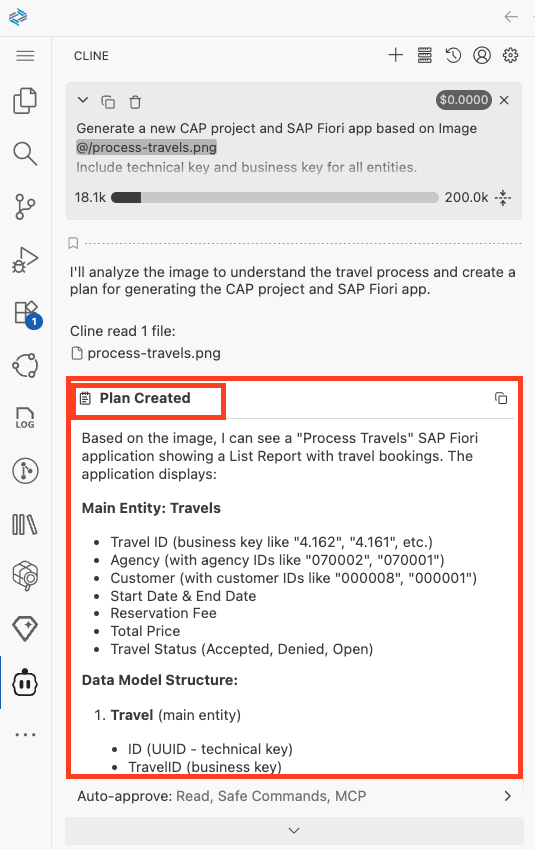
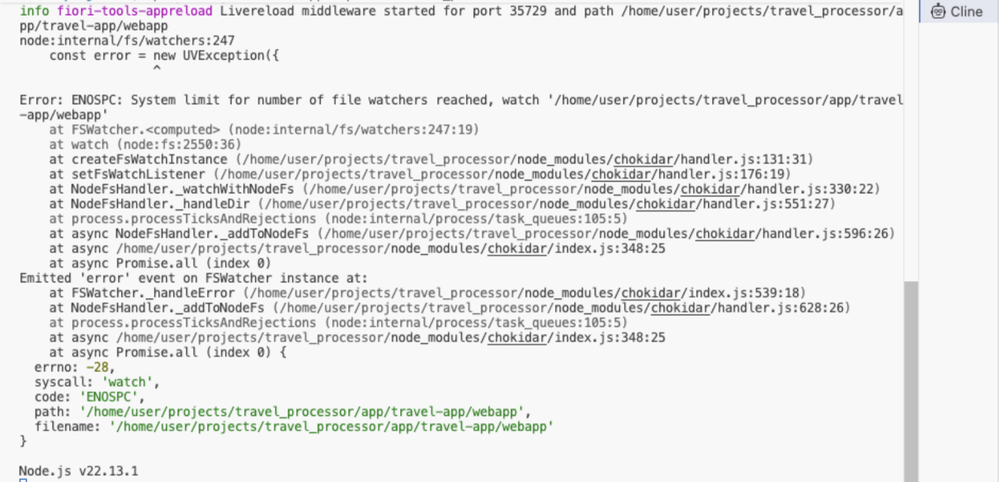
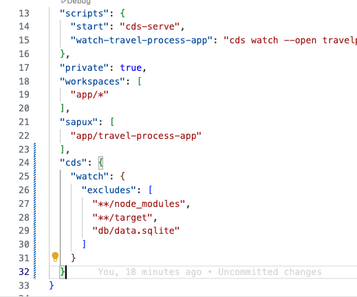

## Create CAP Project and Fiori List Report App based on Image

1. In the Cline panel, choose **Plan Mode**.

    

2. Copy and paste the following prompt into the task input:  
   ```
   Generate a new CAP project and SAP Fiori app based on Image @/process-travels.png 
   Include technical key and business key for all entities.
   Use MCP servers and follow all rules.
   ```

3. Press `Enter` to execute the task.

4. Cline prepares an **Implementation Plan** using the AI model and MCP servers. Once the implementation plan is ready, review it.

> [!Note]
> The implementation plan generated by Cline may differ from the example shown below. Below image is just for reference.

   

5. Switch to **Act mode**. Cline executes the implementation plan. 

6. After completing all the planned steps, the application should automatically open in your browser, displaying a travel list report application that matches the list report Image.


## Troubleshoot

1) Application preview does not open automatically in the browser:

   - Close task.

        

   - Enter prompt `Preview application`
   - If the issue still exists, then you can start watch script manually.
      - Open the `package.json` file.
      - Right click on watch script and select `Run Script`.

   

2) ENOSPC: System limit for number of file watchers reached.

    

    Add below script to package.json file

    ```
    "cds": {
        "watch": {
            "excludes": [
                "**/node_modules",
                "**/target",
                "db/data.sqlite"
            ]
        }
    }
    ```
    

3) If HTTP port 4004 is already in use, press `Enter` to restart preview with a different port number. 
    
    Note: Ensure that you either use 4004 or the system-assigned port for the preview. Check terminal instances and delete duplicate process running to preview application. 

    

4) If the application prompts for authentication, use username: `dummy` and password: `dummy`

5) In the browser, If your application does not load or displays a blank page:

- Open Developer Tools in your browser to check the error message.
  - Windows: Press `F12` or `Ctrl + Shift + I`
  - Mac: Press `Cmd + Option + I`

    

- For a 404 error, enter the prompt:  
    `Error: Could not load metadata: 404 Not Found`
  - Press `Enter` and Cline will fix the service URL path issue.

- For a 200 error, enter the prompt:  
    `Check if the EDM JSON expression ($edmJson) syntax is incorrect and validate it using CAP MCP.`
- If the issue still exists, enter this prompt:
    `Remove all instances of EDM JSON ($edmJson) expression syntax from the code.`

---

Continue to - [Exercise 1.1 - Enable automatic data loading in List Report](../ex1.1/README.md)