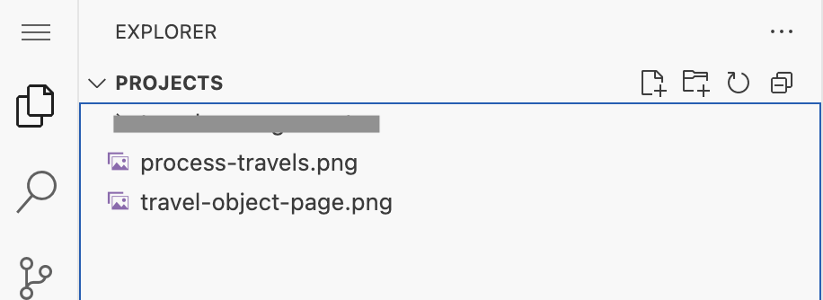

## Modify travel object page based on Image

1. Close previous task.

   

2. Select **Plan Mode**.

   

3. Download image [travel-object-page](./images/travel-object-page.png).

4. Drag and drop image(travel-object-page.png) to Explorer.

   

5. Enter the following prompt in the task input:  
   ```
   Modify the travels object page based on Image @/travel-object-page.png
   The object page should include a bookings table section.
   Add mock data for the bookings table.
   ```
6. Press `Enter` to start the task.
7. Cline will generate an **Implementation Plan**.
8. Review the plan once it's ready. 

> [!Note]
> The implementation plan generated by Cline may differ from the example shown below.


9. Switch to **Act mode**.

10. Cline will execute the implementation plan.

11. After completion, verify the object page in the application preview.
    - Verify object page header contains both title and description.
    - Make sure fields in the `General Information` are arranged as per Image.


## Troubleshoot

1) Update the Object Page Title and Description based on the image. Use the following prompt:  
```
Set the travel description as the object page title and display the travel title below it.
```

2) Some fields in the General Information section are missing. Use the following prompt:  
```
Arrange or add fields in the General Information section as shown in the image @/travel-object-page.png.
```

Continue to - [Exercise 2.1 - Add Custom Section with RichTextEditor Building Block](../ex2.1/README.md)
