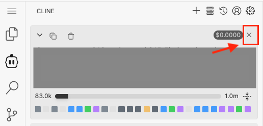
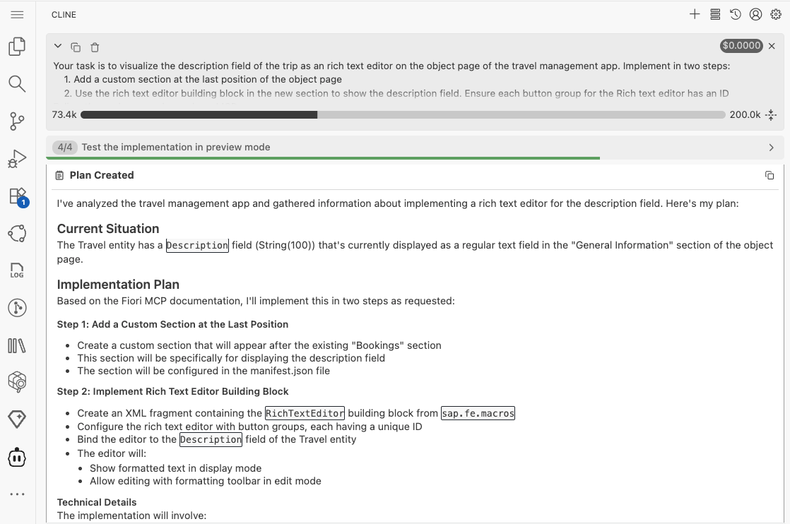
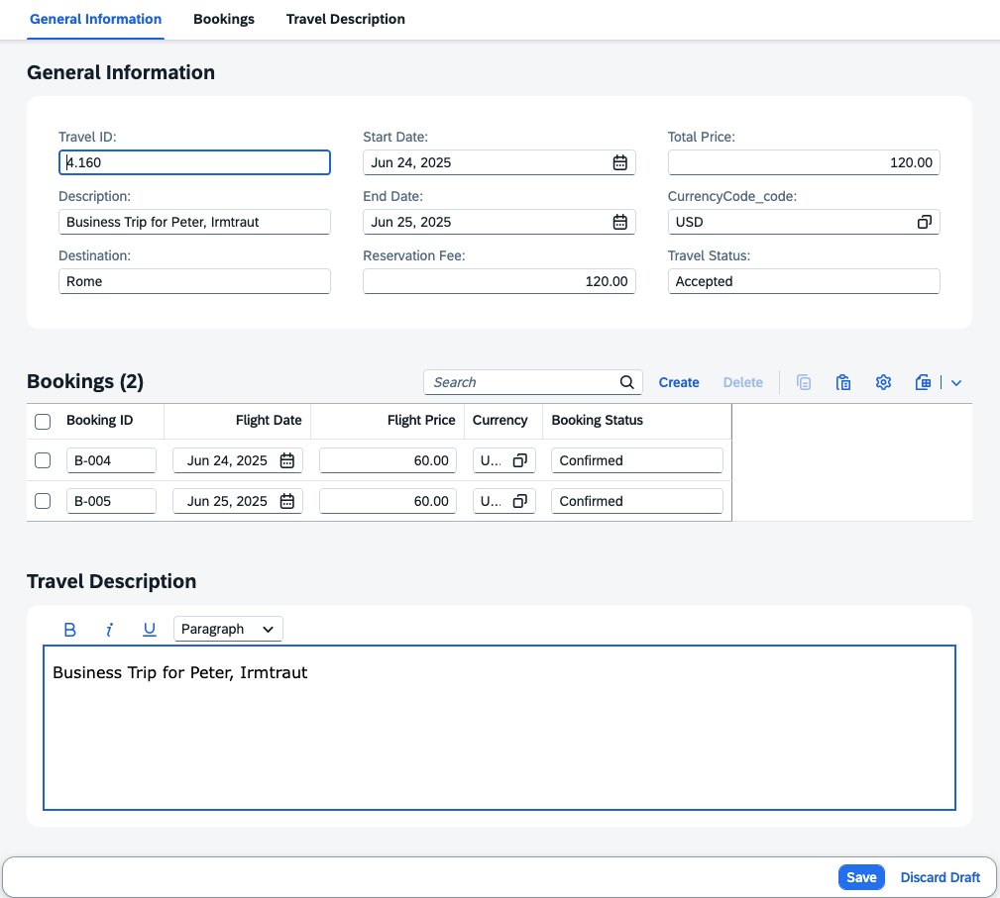

## Add Custom Section with RichTextEditor Building Block

1. Close previous task.

   

2. Select **Plan Mode**.

   

3. Enter the following prompt in the task input:  
   ```
   Your task is to visualize the description field of the trip as an rich text editor on the object page of the travel management app. Implement in two steps:
    1. Add a custom section at the last position of the object page
    2. Use the rich text editor building block in the new section to show the description field. Ensure each button group for the Rich text editor has an ID
    Follow the workspace rules and use MCP servers.

   ```
4. Press `Enter` to start the task.
5. Cline will generate an **Implementation Plan**.
6. Review the plan once it's ready.

> [!NOTE]
> The implementation plan generated by Cline may differ from the example shown below.



7. Switch to **Act mode**.

8. Cline will execute the implementation plan.

9. After completion, confirm that the travel notes section is visible on the travel object page.
10. Click the Edit button in the top right corner.
11. In the travel notes section, select some text and apply bold formatting.
12. Click Save and verify the object is saved successfully.



## Troubleshoot

1. No `Edit` button on travel object page.
      Execute prompt 
      ```
      Enable draft mode for travel entity
      ```

Continue to - [Exercise 3 - Add Object Page for Booking Details](../ex3.0/README.md)
